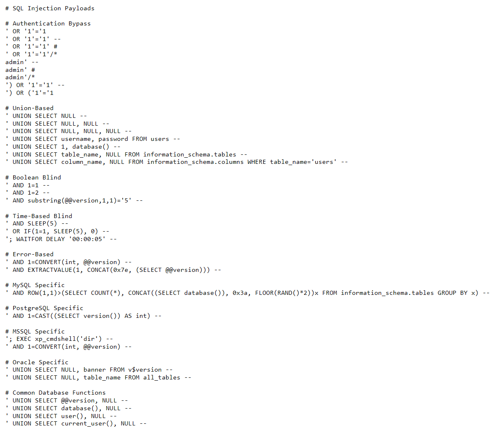

# SQL Injection Concepts

## What is SQL Injection?

SQL Injection (SQLi) is a code injection technique that exploits security vulnerabilities in an application's database layer by inserting malicious SQL statements into input fields.

## Types of SQL Injection

### 1. In-Band SQLi (Classic)
- **Error-Based**: Exploits error messages from the database to extract information
- **Union-Based**: Uses UNION operator to combine results from multiple SELECT statements

### 2. Blind SQLi
- **Boolean-Based**: Sends SQL queries and observes application responses
- **Time-Based**: Uses database sleep/delay functions to infer information

### 3. Out-of-Band SQLi
- Uses different channels to extract data (DNS, HTTP requests)

## Common Payloads



```sql
-- Authentication Bypass
' OR '1'='1
' OR '1'='1' --
' OR '1'='1' #
admin' --

-- Union-Based Extraction
' UNION SELECT NULL, NULL, NULL --
' UNION SELECT username, password FROM users --

-- Error-Based
' AND 1=CONVERT(int, (SELECT @@version)) --
```

## Testing Process

1. **Identify Injection Points**: Look for user inputs (login forms, search boxes, URL parameters)
2. **Test for Vulnerabilities**: Submit special characters (', ", ;, --)
3. **Determine Database Type**: Use version-specific functions
4. **Extract Data**: Use appropriate SQLi techniques
5. **Document Findings**: Record all successful payloads and results

## Tools

- SQLMap
- Burp Suite
- Manual testing with browser developer tools

## References

- OWASP SQL Injection Guide
- PortSwigger SQL Injection Cheat Sheet
